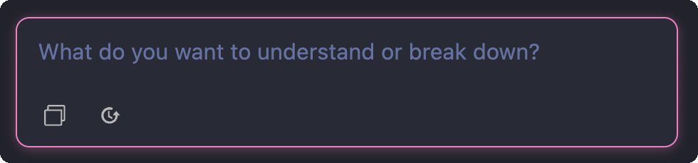
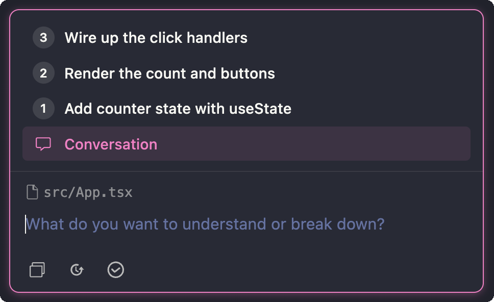
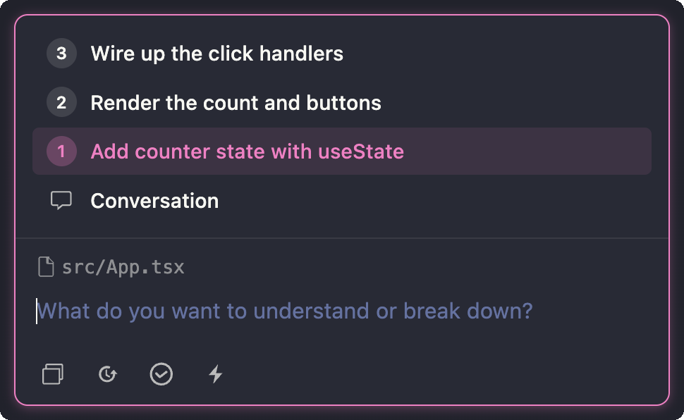

  

<em>A coding agent where you still code</em>

## Getting started

1. Install and authenticate the [Claude Code CLI](https://code.claude.com/docs/en/quickstart)
2. Install the CodeSpark extension: [Install in VS Code](https://marketplace.visualstudio.com/items?itemName=codespark.codespark-agent)

## How it works

### Assistant (`Cmd+Shift+I` / `Ctrl+Shift+I`)

Your thinking partner. Lives in the sidebar. Powered by Claude Code CLI running default models. It can read files, grep through your codebase, search the web, and fetch documentation. It helps you understand code and break down work into guided steps.

- Use `Cmd+Shift+I` / `Ctrl+Shift+I` from a file to open the assistant with that file as context
- Ask questions, explore approaches, and gather context
- When you want to implement something, the assistant creates a **breakdown** — a list of focused steps, each targeting a specific file

### Prompt states

The prompt's toolbar adapts to where you are in the flow.

**1. Empty conversation** — just the prompt.

  

- **New session** resets the conversation
- **Sessions** opens the history of previous sessions

**2. Conversation view with a breakdown** — the assistant has produced steps, and you're viewing the full conversation. Selecting _Conversation_ keeps the chat focused on the whole breakdown rather than one step.

  

- **Review** asks the assistant to review the changes you've made against the breakdown and suggest improvements

**3. Step selected** — you've picked a specific step to work on. The prompt now references that step, and a new button appears.

  

- **Fast Edit** hands the selected step to the fast editing agent to apply mechanically
- Any follow-up you send is scoped to the selected step — steps act like **threads**. The exchange is also visible inline in the main conversation, so you never lose the wider context

## Breakdowns

A **breakdown** is a list of focused steps, each targeting a specific file — but _you_ implement them. The assistant helps you understand the problem, explores the codebase, and generates the context you need to move fast. Then you write the code, or let the fast editing agent handle the mechanical parts while you stay in control.

This matters because **you are responsible for your codebase**. Your understanding of it is not a nice-to-have — it is what makes you effective. That understanding evolves through implementation, not through review. Every time you write code, you reinforce your mental model. Every time you skip implementation and only review, that model atrophies.

The breakdown makes this practical:

- **Context generation is fast** — the assistant reads files, searches the codebase, and synthesizes what you need to know.
- **Context is sticky** — because you implement the steps, what you learn stays with you. It becomes part of how you think about the codebase.
- **Token cost drops dramatically** — a breakdown is a fraction of the tokens an agent spends implementing changes end-to-end.
