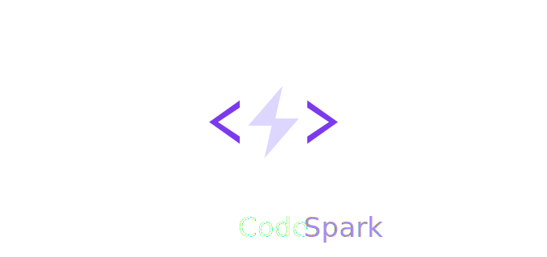

  

<em>The inline agent for writing code</em>

> You don't need to own every keystroke — but you do need to own the expression of your intent. And that happens at the file level, where you're closest to the code — not from a project-wide prompt.

Project-level agents like Claude Code, Copilot Agent, and Cursor are powerful. They explore your repo, run commands, debug across files, and plan complex changes. They operate in dynamic context — long sessions where the agent drives most of the decisions.

When it's time to actually write code, you want something different. Short sessions. Fast momentum. Full ownership of every change. You want to stay in your editor, point at the code, and say what needs to happen.

## Project context

CodeSpark reads your `CLAUDE.md` and `AGENT.md` files so it knows your project's patterns and conventions. The edits it makes aren't generic — they match how _you_ write code in _this_ project.

You can link to files and directories from these files. Linked files are read into context so the agent understands their contents. Linked directories are expanded to show their filenames, giving the agent awareness of the project structure without loading every file.

These same files also improve your project-level agents — giving them better guidance for planning refactors, suggesting implementation approaches, and understanding how your codebase works.

## Getting started

1. Install the extension
2. Choose a provider in settings: **Copilot** (default, uses your GitHub Copilot subscription) or bring your own API key for Anthropic, OpenAI, Google, Mistral, Groq, xAI, OpenRouter, or Together
3. Open a file, press `CMD+I`, type an instruction

Invoke with `CMD+I` (`Ctrl+I` on Windows/Linux), type your instruction, and the edit lands directly in your file.

## Under the hood

CodeSpark uses a real agent harness powered by [pi.dev](https://pi.dev), configured with deterministic context and awareness of where your cursor is. Most edits are fast, single-turn file-scoped changes — but when the task demands it, the agent can read additional files and go as wide as it needs, just like a traditional agent. The difference is that it always stays within its bounds: working with the code of the project, never running commands or reaching outside it.

## Default models per provider

| Provider   | Default Model                               |
| ---------- | ------------------------------------------- |
| copilot    | `claude-haiku-4.5`                          |
| anthropic  | `claude-haiku-4-5-20251001`                 |
| openai     | `gpt-4.1-mini`                              |
| google     | `gemini-2.5-flash`                          |
| openrouter | `anthropic/claude-haiku-4-5-20251001`       |
| groq       | `llama-4-scout-17b-16e-instruct`            |
| xai        | `grok-3-mini`                               |
| mistral    | `mistral-medium-latest`                     |
| together   | `meta-llama/Llama-4-Scout-17B-16E-Instruct` |
