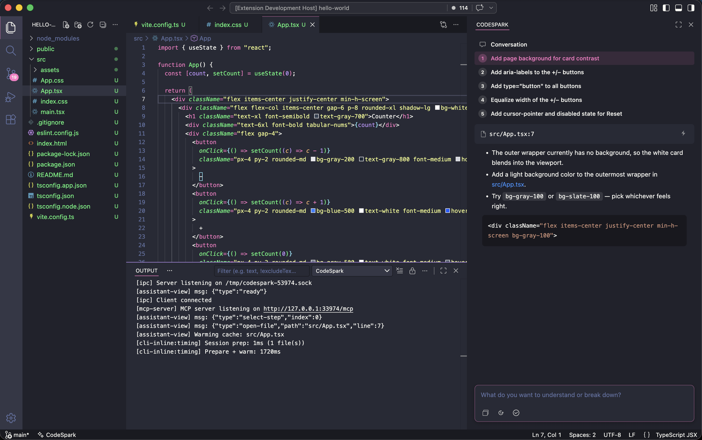

<p align="center">
  
</p>

<p align="center"><em>Claude Code at the tip of your cursor</em></p>

> AI coding agents are great for personal projects where you can YOLO your way through at a high level of abstraction. But in teams and established codebases, handing control to an agent means giving up decision-making, ownership, and learning. CodeSpark is a different kind of experience — it runs the Claude Code CLI under the hood, but designed to keep **you** in the driver's seat. You navigate, you decide, you learn. The agent handles the mechanics.

Two agents, one workflow: a fast **inline agent** for editing code at your cursor, and a **research agent** for deep codebase exploration and web search.



## Getting started

1. Install the [Claude Code CLI](https://docs.anthropic.com/en/docs/claude-code) and authenticate (`claude` in your terminal and restart VSCode)
2. Install the CodeSpark extension: [Install in VS Code](https://marketplace.visualstudio.com/items?itemName=codespark.codespark-agent)

## How it works

### Inline agent (`Cmd+I` / `Ctrl+I`)

Powered by Claude Code running Haiku, optimized for speed. It works from your cursor, editing the file you're looking at. Most edits are fast, single-turn, file-scoped changes. When the task demands it, the agent reads and writes additional files and goes as wide as it needs — but it always stays within the code, never running commands or reaching outside the project.

- The current file content and cursor position
- The closest `CLAUDE.md` in the directory hierarchy (from the file's directory up to the workspace root)
- Any files linked from those `CLAUDE.md` files (read into context)
- Any directories linked from those `CLAUDE.md` files (expanded as file listings)
- The latest research summary from the research agent

### Research agent (`Cmd+Shift+I` / `Ctrl+Shift+I`)

Powered by Claude Code, this is a dedicated research tool. It can read files, grep through your codebase, search the web, and fetch documentation — but it cannot edit anything. When the research panel is already open, invoking it again attaches the current file and cursor position as context.

The output is integrated with VS Code: file paths like `src/foo.ts:42` become clickable links that open the file at that line, and fenced code blocks with `bash` render with a run button that executes the command in your terminal.

The two agents are connected: ask a question in the research panel, and the next time you invoke the inline agent, it knows what you learned.

### CLAUDE.md

`CLAUDE.md` files are how you control agent behavior. Place one at the workspace root for project-wide instructions, and add more in subdirectories for domain-specific guidance. When you invoke the inline agent, it picks up the root `CLAUDE.md` plus the closest one in the directory hierarchy above the file you're editing.

This is the same `CLAUDE.md` convention used by Claude Code in the terminal. Instructions you write for CodeSpark — patterns, conventions, constraints, preferred libraries — also improve Claude Code when you use it from the CLI. You're not maintaining two configurations; you're building one set of instructions that makes the agent better everywhere.

### Edit review

Every inline edit is silently logged. When you've accumulated a few, a review button with a counter badge appears in the research panel toolbar. Click it to enter **review mode**: the research agent analyzes your recent edits for recurring patterns and proposes `CLAUDE.md` changes.

Suggestions appear as a list above the input area — each showing a file path (clickable to open a diff preview) and a description. You can discuss them in the chat ("combine those two", "make that more specific") and the agent updates the list as the conversation evolves.

When you're satisfied, click **Approve all** to write the changes to disk, or **Dismiss** to discard them. Either way the edit log is cleared and a fresh session starts.

## Shortcuts

| Mac           | Windows / Linux | What it does                                                                                                      |
| ------------- | --------------- | ----------------------------------------------------------------------------------------------------------------- |
| `Cmd+I`       | `Ctrl+I`        | Open the inline agent — describe a change and it edits the file at your cursor                                    |
| `Cmd+Shift+I` | `Ctrl+Shift+I`  | Open the research agent — attaches the current file and cursor position as context when the panel is already open |

These shortcuts may conflict with other extensions (e.g. GitHub Copilot uses the same bindings). To rebind them, open the command palette and search for "Preferences: Open Keyboard Shortcuts (JSON)", then add your preferred bindings:

**Mac** — `Cmd+Shift+P` > "Preferences: Open Keyboard Shortcuts (JSON)"

```json
[
  { "key": "cmd+i", "command": "codeSpark.invoke", "when": "editorTextFocus" },
  { "key": "cmd+shift+i", "command": "codeSpark.openResearch" }
]
```

**Windows / Linux** — `Ctrl+Shift+P` > "Preferences: Open Keyboard Shortcuts (JSON)"

```json
[
  { "key": "ctrl+i", "command": "codeSpark.invoke", "when": "editorTextFocus" },
  { "key": "ctrl+shift+i", "command": "codeSpark.openResearch" }
]
```

## Inline agent performance

The inline agent is optimized for low-latency edits (~1.5–2s typical). Here's how:

**Long-lived MCP server.** The MCP server that bridges the Claude CLI and VS Code uses Streamable HTTP transport, started once at extension activation. Each CLI invocation connects to the already-running server instead of spawning a new process, eliminating ~300ms of MCP boot overhead per edit.

**Session pre-population.** When you press `Cmd+I`, the CLI process is spawned immediately and a session file is pre-built with fake `Read` tool results containing the current file content. This puts the file in context without requiring an actual Read tool call, and an assistant prefill message primes the model to go straight to `edit_file` without explanatory text.

**Prompt cache warming.** The Anthropic API caches prompt prefixes — system prompt, tool definitions, and conversation history — so repeated edits process only the new instruction. When the estimated token count exceeds the caching threshold (4,096 for Haiku), a lightweight pre-warm message is sent to the CLI while the user types their prompt. By the time the real instruction is submitted, the cache is hot and the API skips reprocessing the prefix.

**All edits go through VS Code.** File modifications use the `WorkspaceEdit` API via an IPC server, keeping edits in the undo stack and integrated with the editor. The diff between before/after text (via the `diff` library) determines which lines changed, driving both the focus scroll and the post-edit dimming effect.
