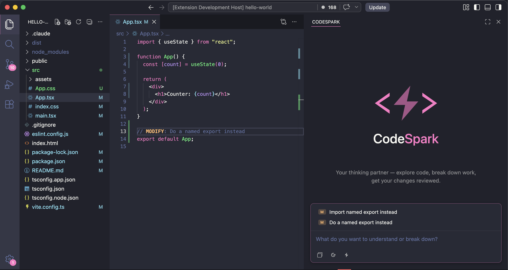

<p align="center">
  
</p>

<p align="center"><em>A coding agent where you still code</em></p>



## Getting started

1. Install and authenticate the [Claude Code CLI](https://code.claude.com/docs/en/quickstart)
2. Install the CodeSpark extension: [Install in VS Code](https://marketplace.visualstudio.com/items?itemName=codespark.codespark-agent)

## How it works

### Intent comments

You drive the work by writing intent comments directly in your code:

```ts
// MODIFY: extract this into a separate hook
// ADD: add error boundary around this component
// REMOVE: delete this deprecated helper
```

CodeSpark detects these across your entire workspace, highlights the keywords in the editor, and lists them in the sidebar. When you're ready, click the bolt button to send all intent comments to the assistant — it reads each one, navigates to the right file and line, and applies the changes. Files are saved automatically after each edit.

Use `Cmd+Shift+I` while the cursor is in an editor to toggle an intent comment on the current line. Each press cycles through `MODIFY → ADD → REMOVE → off`. The comment style matches the language (JS/TS uses `//`, Python uses `#`, JSX uses `{/* */}`, etc.) and inherits the indentation of the current line.

### Assistant

The assistant lives in the sidebar. Ask it questions, explore approaches, or have it look things up — it can read files, search your codebase, fetch documentation, and run git commands. It won't touch your code unless you trigger the bolt.

Open it with `Cmd+Shift+I` / `Ctrl+Shift+I` when not in an editor. If you have a file open, it opens with that file as context.

## Why this approach

Coding is not about the characters you type. It is about how you choose to solve a problem — where you put the code, what it represents, how the pieces relate, which dependencies you reach for. Those decisions are the work. The keystrokes are just how you record them.

AI is genuinely useful in two situations: when you have a clear solution and just want to reduce the mechanical effort of writing it out, and when you don't have a clear solution and need help gathering context, exploring options, or thinking it through. What it should never do is make you stop thinking.

**The inline prompt problem.** The agent edits that one spot without knowing what else you're planning. Every edit is locally plausible but at risk of being globally wrong. And beyond correctness, there's the rhythm: you highlight, you wait, you review, you accept or reject, then find your place again. That constant stop-start works against the flow that good coding depends on — the natural pace of navigating a codebase and typing what you mean.

**The project prompt problem.** Handing the whole task to an agent — "implement this feature," "fix this bug" — has the opposite failure. The agent gets broad context but you get broad disconnection. You stop navigating your own codebase. You stop building the breakdown in your head: which files are affected, which abstractions are load-bearing, which changes cascade. The moment you hand it off entirely, the codebase starts to decay — and so does your understanding of the system you're responsible for.

**Intent comments keep you in the loop.** When you write an intent comment, you've already made a decision: this file, this location, this kind of change. You stay the author. The breakdown lives in your code, not in a prompt box. When you trigger the bolt, the agent sees everything at once — every file, every planned change, the full shape of what you're doing — and handles the mechanical execution. The understanding stays with you.

The assistant is there for the moments when you don't have clarity yet. Ask it a question, explore an approach, have it read some files. Once you know what you want to do, write the intent comment and move on.

## Configuration

| Setting | Default | Description |
|---|---|---|
| `codespark.prDescriptionTemplate` | (built-in template) | Markdown template used for PR descriptions created by the agent. Edit via the Settings UI (rendered as a textarea) or `settings.json`. |

## Commands

CodeSpark registers the following commands (accessible via the Command Palette). You can bind them to keyboard shortcuts in your `keybindings.json`:

| Command | Default shortcut | Description |
|---|---|---|
| `codeSpark.openAssistant` | `Cmd+Shift+I` (when not in editor) | Open the assistant with the current file as context |
| `codeSpark.toggleIntentComment` | `Cmd+Shift+I` (when in editor) | Cycle `MODIFY → ADD → REMOVE → off` on the current line |
